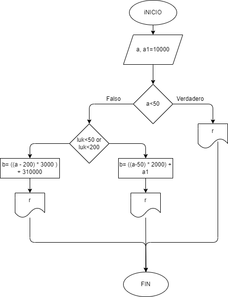

# Ejercicio

## Calcular el gasto de agua de una vivienda, dado el numero de metros cubicos gastados, siendo el sistema de cobro el siguiente:
### - La cuota fija mensual es de 10 mil pesos  
### - Los primeros 50 m^3 son gratis
### - Entre 50 y 200 m^3 se cobra el m^3 a 2 mil pesos
### - apartir de 200 m^3 se cobra el m^3 a 3 mil pesos

## Diagrama De Flujo
